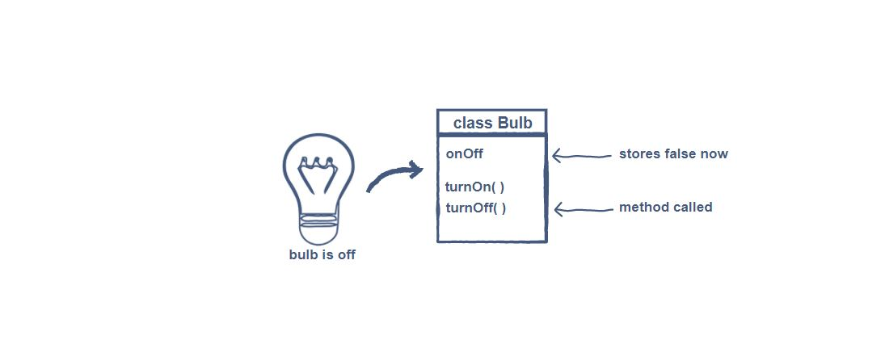

<!DOCTYPE html>
<h1>Introduction to OOPS</h1>

<h2>Procedural Programming </h2>

If you’re here, you’re probably familiar with the basics of programming already and have used methods in
 your programs at some point.Procedural programming is one programming paradigm among many.In procedural programming, a program is 
 divided into smaller parts called methods. These methods are the basic entities used to construct a program. One of the main advantages
 of procedural programming is code reusability. However, the implementation of a complex real-world scenario becomes a difficult task 
  unwieldy.

 <h2>Object-Oriented Programming </h2> 
 
<code>Object-oriented programming, also referred to as <b>OOP</b>, is a programming paradigm that includes, or relies, on the concept of classes and objects.</code>

The basic entities in object-oriented programming are classes and objects.
Programming isn’t much use if you can’t model real-world scenarios using code, right? 
This is where Object-Oriented Programming comes into play.

<code>The basic idea of OOP is to divide a sophisticated program into a bunch of objects talking to each other.</code>
Objects in a program frequently represent real-world objects.

Many other objects serve application logic and have no direct, real-world parallels. They manage things like authentication, templating, request handling, or any of the other myriad features needed for a practical application.
    
<h2>Anatomy of Objects and Classes #</h2>

Objects may contain data in the form of fields (variables) and methods to operate on that data.

Think about the real-world objects around you. What are the characteristics of these objects? Take the example of a light bulb. It has a <b>state</b>, i.e., either it is on or off. It also has a <b>behavior</b>, i.e., when you turn it on it lights up, and when turned off, it stops spreading light. To conclude this, one can say:

<code>Objects are a collection of data and their behaviors.</code>

Interesting! Isn’t it? But the question is “where do these objects come from?”

Well, the answer to the above question is classes.

<code>A Class can be thought of as a blueprint for creating objects.</code>

The below illustration shows what a <b>LightBulb</b> class should look like:

From the above illustration, you can see that the state of the object is generally modeled using variables in a class, and the behavior is modeled using methods.

There can be many different objects of the same class. Each can be in an independent state, but they all share the same behavior and characteristics.

<## User-Defined Data Types #>