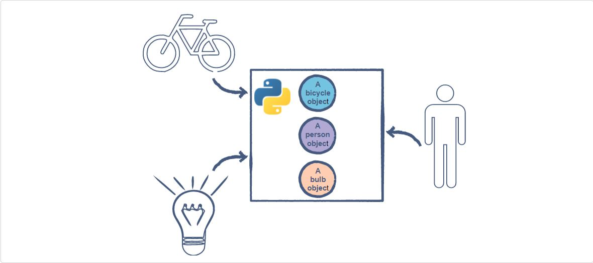

<!DOCTYPE html>
<h1>Introduction to OOPS</h1>

<h2>Procedural Programming </h2>

If you’re here, you’re probably familiar with the basics of programming already and have used methods in
 your programs at some point.Procedural programming is one programming paradigm among many.In procedural programming, a program is 
 divided into smaller parts called methods. These methods are the basic entities used to construct a program. One of the main advantages
 of procedural programming is code reusability. However, the implementation of a complex real-world scenario becomes a difficult task 
  unwieldy.

 <h2>Object-Oriented Programming </h2> 
 
<code>Object-oriented programming, also referred to as <b>OOP</b>, is a programming paradigm that includes, or relies, on the concept of classes and objects.</code>

The basic entities in object-oriented programming are classes and objects.
Programming isn’t much use if you can’t model real-world scenarios using code, right? 
This is where Object-Oriented Programming comes into play.

<code>The basic idea of OOP is to divide a sophisticated program into a bunch of objects talking to each other.</code>
Objects in a program frequently represent real-world objects.

Many other objects serve application logic and have no direct, real-world parallels. They manage things like authentication, templating, request handling, or any of the other myriad features needed for a practical application.
    